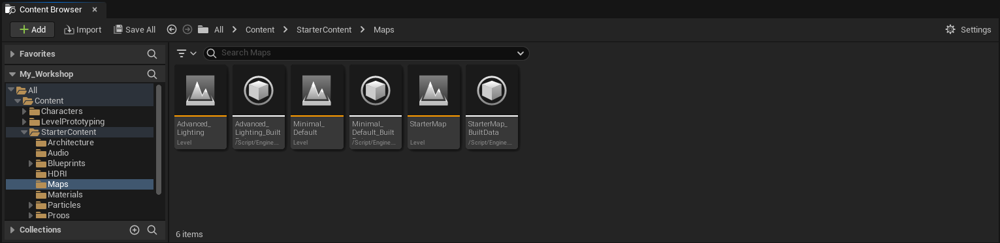
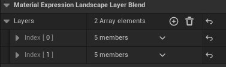

# Workshop UnrealEngine Part 1

## Introduction

Bienvenue dans ce workshop de création de Landscape dans Unreal Engine.

Dans ce workshop, nous allons voir comment créer un Landscape afin d'avoir un décors `réaliste`, le sculpter et le peindre.

Nous allons également voir comment créer un Material afin de peindre notre Landscape.

Ce workshop est découpé en 4 parties :

- Partie 1 (ce workshop) : [Création/Sculpture/Peinture du terrain](https://github.com/Kenan-Blasius/Workshop-UnrealEngine-Part-1)
- Partie 2 : [Création de décors](https://github.com/Kenan-Blasius/Workshop-UnrealEngine-Part-2)
- Partie 3 : [Importation de model exterieur/Création de particule](https://github.com/Kenan-Blasius/Workshop-UnrealEngine-Part-3)
- Partie 4 : [Apprentissage du Blueprint](https://github.com/Kenan-Blasius/Workshop-UnrealEngine-Part-4)

## Création d'un projet

Pour commencer, ouvrez le lanceur Epic Games, rendez-vous dans l'onglez Unreal Engine, puis dans l'onglet `Bibliothèque`.

Ici vous trouverez les différentes versions de Unreal Engine que vous possédez ainsi que vos différents projets et vos assets si vous en avez (assets gratuits du mois ou assets payant) :

Cliquez sur lancer sur la version d’Unreal Engine 5.3.2 que vous possédez puis patientez.

Cette fenêtre devrait apparaitre :

Une fois dans cette fenêtre, appliquez les paramètres suivants :

- Cliquez sur `Games`

- Cliquez sur `Third Person`

- Et changez les paramètres dans `Project Defaults`

Puis cliquer sur `create` (Vous pouvez changer le `Project Location` et le `Project Name` à votre guise)

Une fois que le projet a fini de chargez vous devriez avoir cette fenêtre :

Vous pouvez sur `Content Browser` et le drag and drop dans la parti inférieur de la vue 3D pour que la fenêtre `Content Browser` ne soit plus une fenêtre flottante.

## Création d'un Level

Dans le `Content Browser`, rendez vous dans le dossier `Content/StarterContent/Maps`.

Une fois dans ce dossier, effectuez un clique droit dans le vide puis Level et nommez le comme vous le souhaitez.

Effectuez un double clique sur le Level que vous venez de créer pour l’ouvrir.

Si cette fenêtre apparait, cliquez sur `Save Selected`:

Vous devriez maintenant avoir une fenêtre completement noir, c'est normal.

Affin d'ajouter un peu de couleur, nous allons ajouter une `SkySphere`.

Pour ce faire nous allons utiliser un asset de l’engine, rendez-vous dans les settings du `Content Browser` et cocher `Show Engine Content`:

Puis aller dans l’arborescence des fichiers (partie gauche du `Content Browser`) et allez dans `Engine/Content` puis cherchez `Sky`

Puis cliquez et déposez le `SkySphere` dans le Level (l'écran noir).

Votre Level devrait maintenant ressembler à ça :

Afin de bien s’organiser nous allons créer des dossiers dans notre Level.

Pour cela effectuez un clic droit dans le `Outliner` puis cliquez sur `Create Folder`.

Créez deux dossiers :

- Un dossier `Light` (pour ranger toutes nos lumières)
- Un dossier `Landscape` (pour ranger notre Landscape et tout ce qui y serait lier)

Maintenant cliquez sur `BP_Sky_Sphere` et glissez la dans le dossier `Light`

Votre outliner devrait maintenant ressembler à ça :

## Création d'un Landscape

Maintenant que nous avons notre Level, nous allons créer notre Landscape.

Pour ce faire rendez-vous dans le coin supérieur gauche de l’éditeur, cliquez sur `Selection Mode` et sélectionnez `Landscape`.

Puis cliquez sur `Create` pour créer votre Landscape.

Vous devriez maintenant avoir un un grand carré noir, pas de panique, encore une fois c'est normal.
Nous ne possédons pour l'instant d'aucune lumière dans notre Level, c'est pour cela que nous ne voyons qu'une ombre.

Afin d'ajouter de la lumière, dans un premier temps nous allons retourner en mode `Selection Mode`, pour ce faire, comme pour le mode `Landscape`, cliquez sur `Landsacpe Mode` en haut à gauche de l'éditeur puis cliquez sur `Selection`.

Puis dans le `Content Browser` cliquez sur le dossier `All` et cherchez `Sky Light`. Puis cliquez et déposez le dans le Level.

Votre Level devrait maintenant ressembler à ça :

Maintenant organisons un peu notre Level, pour ce faire, dans le `Outliner` cliquez sur `Landscape` et glissez le dans le dossier `Landscape`.

## Sculpture du Landscape

Maintenant que nous avons notre Landscape, nous allons le sculpter afin de lui donner un peu de relief.

Pour ce faire, retournez en mode `Landscape Mode` et cliquez sur `Sculpt`.

Vous devriez maintenant avoir cette fenêtre :

Dans cette fenêtre vous pouvez voir plusieurs outils :

- `Sculpt`  : Permet de sculpter le terrain
    
- `Erase`   : Permet d’effacer le terrain
    
- `Smooth`  : Permet de lisser le terrain
    
- `Flatten` : Permet de lisser le terrain en gardant la hauteur de la zone sélectionnée
    

- `Landscape Editor`

  - `Brush Type`    : Permet de changer la forme du pinceau
  - `Brush Falloff` : Permet de changer la forme de l'atténuation du pinceau (atténuation linéaire, sphérique, etc...)

    

- `Brush Settings`

  - `Brush Size`    : Permet de changer la taille du pinceau
  - `Brush Falloff` : Permet de changer la taille de l'atténuation du pinceau

    

## Ajout de matériaux sur le Landscape

Maintenant que nous avons sculpté notre Landscape, nous allons lui ajouter des matériaux afin de lui donner un peu de couleur.

Dans un premier temps, nous allons créer un Material afin de créer le `Blueprint` permettant de peindre notre Landscape.

Pour ce faire, rendez vous dans le dossier `Content`, puis effectuez un clic droit et cliquez sur Material, nommez-le comme vous le souhaitez.

Ouvrez le Material (double-clic dessus) et vous devriez voir une fenêtre comme celle-ci :

Nous allons ajouter des textures à notre Material.

Pour cela rendez-vous dans `Content/StarterContent/Textures`.

Sélectionnez les textures `T_Ground_Grass_D` et `T_Ground_Grass_N` et glissez les dans la fenêtre du Material.

Maintenant dans les paramètres du Material, cochez `Use Material Attributes`.

Nous allons maintenant créer la node permettant de définir les couleurs de notre Material.

Pour ce faire, faites un drag and drop de `Material Attributes` et cherchez `Make Material Attributes`.

Reliez ensuite vos node comme ceci pour appliquer la texture et la normal map :

> [!tip]
> Explication des node :
> - `Base Color` : Permet de définir la couleur de base du Material
> - `Normal`     : Permet de définir la normal map du Material

Maintenant nous allons refaire le même chose avec une autre texture (T_Ground_Gravel_D) et une autre normal map (T_Ground_Gravel_N).

Vous devriez avoir quelque chose similaire à ça :

Maintenant tout comme nous avonss créé un Make Material Attributes, nous allons créer un `Landscape Layer Blend` qui va nous permettre de définir les différentes couleurs/texture de notre Landscape.

Une fois la node créée, cliquez sur cette dernière et dans les paramètres de la node cliquez sur `+` pour ajouter deux `Index`.

Puis relier les deux `Make Material Attributes` au node `Landscape Layer Blend` comme suit :

Cliquez sur le `Apply` danss le coin supérieur gauche de la fenêtre du Material.

Fermez la fenêtre du Material.

Cliquez sur le Landscape dans le `Outliner` puis dans les paramètres du Landscape, cherchez `Landscape Material` et cliquez sur la flèche à droite de `Material` puis cherchez le Material que vous venez de créer et sélectionnez le.

Et votre Landscape devrez maintenant... être tout noir, une fois de plus c'est normal.

Retournez en mode `Landscape Mode` puis cliquez sur `Paint` et en bas vous devriez voir les deux `Layers` que vous avez créé dans le Material.

Cliquez sur le `+` puis `Weight-Blended Layer (normal)` et enregistrez les infos dans `Content` (au même endroit que le Material).

Puis vous retrouverais des paramètres similaires à ceux pour le relief (modification de forme, taille, atténuation, etc…) pour peindre votre Landscape.

Quand vous appliquez vos textures sur votre map, vous remarquerez que les textures sont très petites et répétitives, pour éviter cela, nous allons modifier notre Material.

Nous allons faire ce que l’on appelle un `Tiling`.

Pour ce faire, ouvrez votre Material et créez un Node `Constant`.

Puis cliquez sur la Node et assignez lui une valeur (plus la valeur est petite, plus la texture sera grande).

Puis créez un Node `Multiply`, que nous allons relier comme ceci :

Maintenant faites la même chose pour les deux autres textures.

Enfin il ne nous reste plusqu'à ajouter une Node `Texture Coordinate` qui permettra de gérer les textures UV sous la forme d'une valeur à deux canaux (Coordonnées U et V).

Reliez la Node `Texture Coordinate` à la Node `Multiply`.

## Conclusion

Vous avez maintenant les bases pour créer un Landscape dans Unreal Engine.

Vous pouvez vous amuser à créer votre propre Landscape et à le peindre avec les textures de votre choix.
